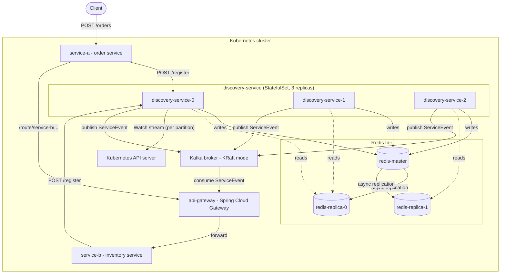
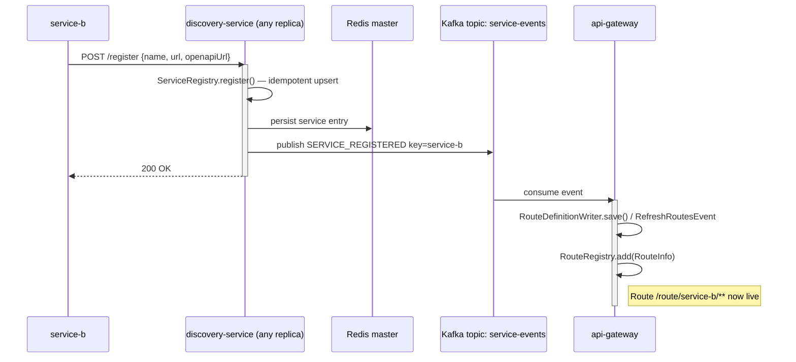
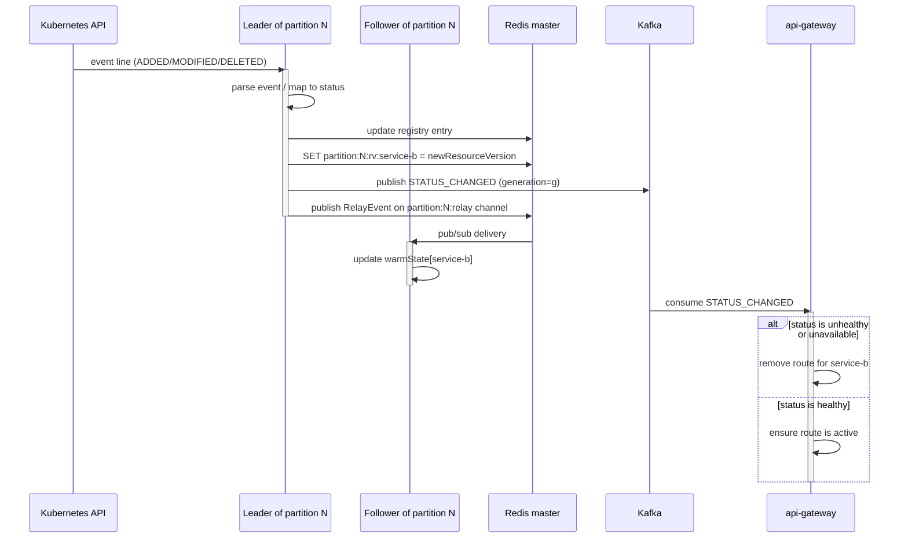
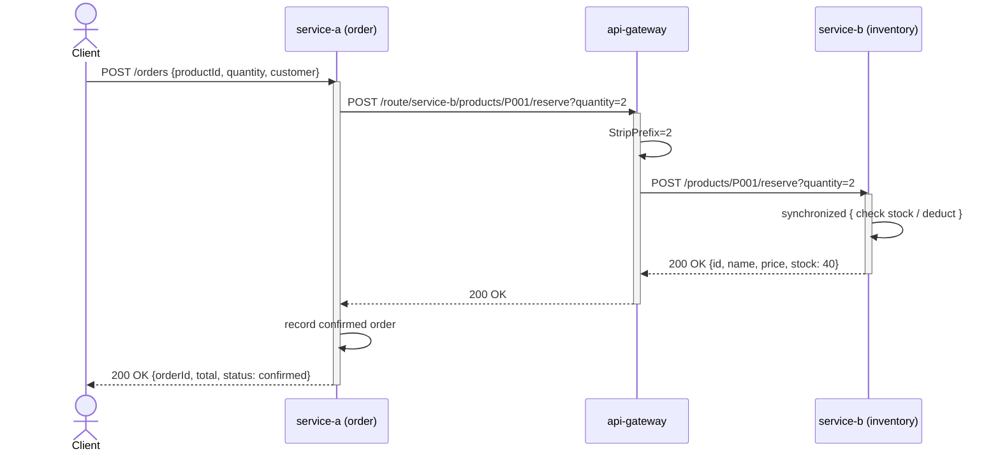

# EDA Microservice Discovery System — Architecture

A Kubernetes-native service registry and event-driven routing layer. Services register on startup, the discovery service tracks pod health via Kubernetes Watch streams, and an API gateway updates its routing table from Kafka events. No service URL is hardcoded anywhere.

---

## Components

| Component | Role |
|---|---|
| `discovery-service` (3 replicas, StatefulSet) | Registry owner. Per-partition leaders watch Kubernetes and publish events; all replicas serve identical reads from shared Redis. |
| Redis (1 master + 2 replicas) | **The registry itself**, plus coordination — leader-election keys, `resourceVersion` keys, pub/sub relay channel. Every replica reads and writes the same service records, so a registration on one replica is immediately visible on all of them. |
| Kafka (single broker, KRaft) | Event bus and outward contract. Carries `SERVICE_REGISTERED`, `SERVICE_DEREGISTERED`, `STATUS_CHANGED`, each stamped with a fencing `generation` and the service's Kafka destinations. Keyed by service name for per-service ordering; **log-compacted**, so replaying from offset 0 rebuilds current state. |
| `api-gateway` (Spring Cloud Gateway) | Consumes Kafka events, maintains live routing table, exposes `/services` catalog and `/openapi/{name}` spec proxy. Schema-*transparent*: it proxies specs, it does not parse them. |
| `service-a` | Order service. Calls the gateway to reach `service-b` — no hardcoded URL. |
| `service-b` | Inventory service. Synchronized stock reservation. |

---

## Data Flows

### Service registration

### Pod state change (Kubernetes Watch)

### Request flow

---

## Leader Election

Each replica runs `tryAcquireOrRenew()` every 3 s per partition.

| Setting | Value |
|---|---|
| Lock key | `discovery:partition:N:leader` |
| TTL | 10 s |
| Renewal | Lua `GET + EXPIRE` (atomic) |
| Identity | `POD_NAME` (Kubernetes Downward API) |
| Graceful release | `@PreDestroy` — sub-second failover |
| Hard crash failover | ≤ 10 s (TTL expiry) |

Followers subscribe to `partition:N:relay` (Redis pub/sub) to stay warm without holding Watch streams. On winning a partition, a replica unsubscribes and opens its own Watch from the last stored `resourceVersion`.

---

## Deployment

| Manifest | Deploys |
|---|---|
| `k8s/discovery-service-deployment.yaml` | StatefulSet (3 replicas), headless + ClusterIP Services |
| `k8s/redis-deployment.yaml` | redis-master (AOF + PVC), redis-replica ×2 |
| `k8s/kafka.yaml` | Single-broker Kafka (KRaft) |
| `k8s/api-gateway-deployment.yaml` | api-gateway |
| `k8s/service-a-deployment.yaml` | service-a (with `preStop` deregister hook) |
| `k8s/service-b-deployment.yaml` | service-b (with `preStop` deregister hook) |

Local dev: `docker compose -f discovery-service/docker-compose.yml up`

Consistency guarantees and failure scenarios: see `docs/CONSISTENCY_REPORT_v3.docx`.

## Consuming the change stream

`service-events` is the supported integration point. A consumer sets its own `group.id`,
starts at offset 0, and rebuilds its table from the replay:

- **Deserialize by schema, not by type.** The producer sends no `__TypeId__` header; each
  consumer declares its own DTO via `spring.json.value.default.type` and sets
  `spring.json.use.type.headers=false`. Do not put a producer-side class on a consumer's
  classpath — that couples the modules and is what the header mechanism silently enforces.
- **Apply the fencing token.** Drop any `STATUS_CHANGED` whose `generation` is lower than
  the highest already seen for that service; treat `SERVICE_REGISTERED` as a lifecycle
  boundary that resets the fence.
- **Use an allowlist on status.** Route or resolve only on `healthy`. `not-ready`,
  `unavailable` and `unknown` all mean "do not send traffic here".
- **Use `ErrorHandlingDeserializer`.** Deserialization happens inside `poll()`, where a
  container error handler cannot see it; without it one bad record stalls the consumer at
  that offset permanently.

Each event carries `inputTopic` and `compensationTopic` (derived by convention from the
service name — `<name>.in` and `<name>.compensate`), so a consumer can resolve a logical
service name to a Kafka destination from its local table without an HTTP call to
discovery.
