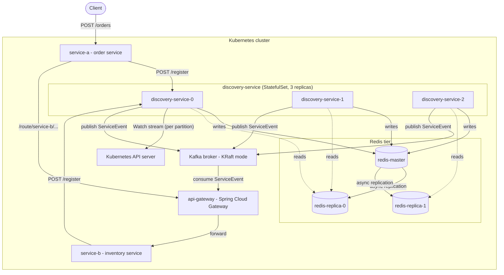
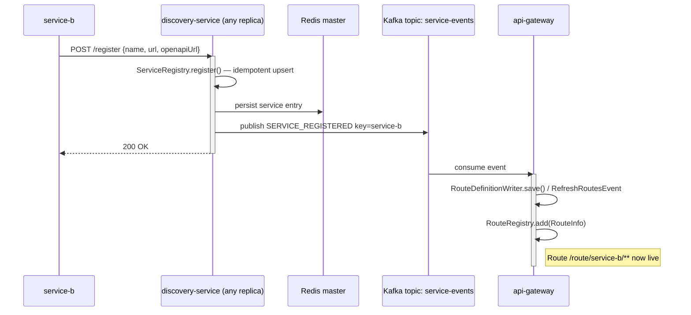
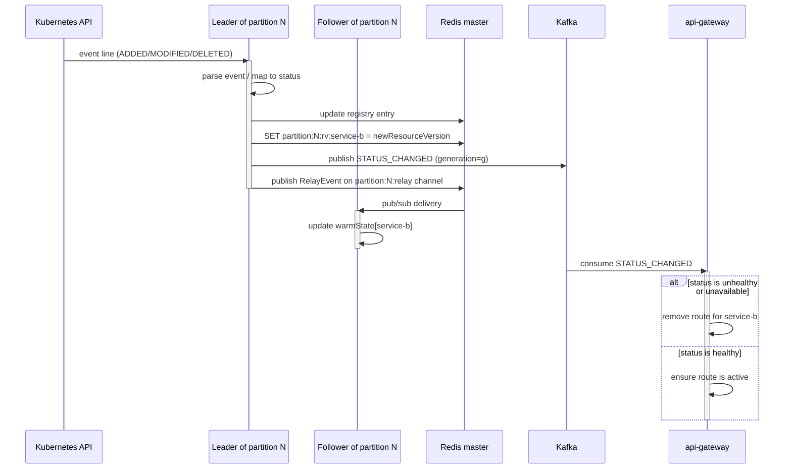
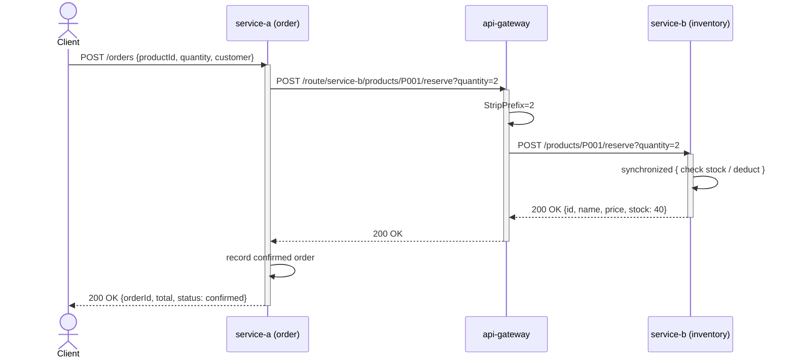

# EDA Microservice Discovery System — Final Report

**Project:** microservice-discovery-k8s
**Version:** Post-Task 4 (partition-replicated discovery with Kafka relay)
**Last updated:** 2026-05-23
**Audience:** Senior engineers, architects, technical reviewers

---

## Table of Contents

1. [Project Overview](#1-project-overview)
2. [System Architecture](#2-system-architecture)
3. [Component Design](#3-component-design)
4. [Data Flow](#4-data-flow)
5. [Scalability and Leader Election](#5-scalability-and-leader-election)
6. [Data Consistency](#6-data-consistency)
7. [Deployment](#7-deployment)
8. [Testing](#8-testing)
9. [Conclusion](#9-conclusion)

---

## 1. Project Overview

### 1.1 What the system does

The EDA Microservice Discovery System is a Kubernetes-native service registry and routing layer. It tracks which microservices are alive, what their HTTP and OpenAPI endpoints are, and forwards traffic to them through a dynamic API gateway. No service URL is hardcoded anywhere in the caller code; instead, every service discovers its peers through the gateway, which learns the topology from an event stream.

### 1.2 The problem it solves

When a microservices system has more than a handful of services, three problems become difficult to manage:

- **Who is running and where?** Pod IPs change on every restart, services scale up and down, and a service that responded a moment ago might not respond now.
- **How do callers find their peers?** Hardcoding URLs couples every caller to every callee. Reconfiguring on each change is fragile.
- **How does routing react to health changes?** A traditional gateway has to be told what to route to. If a service goes down and the gateway does not notice, callers see errors that could have been avoided.

The system addresses these problems by combining a central registry, an event-driven gateway, and Kubernetes-native pod monitoring into one coherent pipeline.

### 1.3 Design goals

- **Sub-second reaction time** to pod state changes (no polling).
- **No hardcoded service URLs** in any caller.
- **Horizontal scalability** for the discovery service itself, with no duplicate work across replicas.
- **Schema awareness** at the gateway — callers can fetch any service's live OpenAPI spec through a single endpoint.
- **Cleanly defined consistency model** so failure behaviour is predictable.

### 1.4 What was built

Four distinct workstreams produced the current system:

| Task | Outcome |
|---|---|
| Leader election | Stopped three discovery replicas from doing the same Kubernetes polling three times. |
| Kubernetes Watch | Replaced the polling loop with a persistent Watch stream. Reaction time dropped from up to 15 seconds to well under a second. |
| API Gateway with Kafka | Removed hardcoded service URLs. The gateway updates its routing table from Kafka events published by the discovery service. |
| Partition-replicated discovery | Sharded the watch load across replicas. Per-partition leaders watch only their assigned services; followers stay warm through a Redis pub/sub relay. |

---

## 2. System Architecture

### 2.1 Component diagram

The diagram below shows the components and their dependencies. Each box is a deployable unit; each arrow is a real network call or stream.



### 2.2 What each component does

| Component | Role |
|---|---|
| `discovery-service` (3 replicas) | Owns the service registry. Per-partition leaders watch Kubernetes and publish events. All replicas serve reads. |
| Redis tier | Shared state — registry contents, leader-election locks, last-seen Kubernetes resource versions, pub/sub channel for follower relay. |
| Kubernetes API server | Source of truth for pod state. Per-partition leaders hold open Watch streams against it. |
| Kafka (single broker, KRaft mode) | Event bus between discovery and the gateway. Carries `SERVICE_REGISTERED`, `SERVICE_DEREGISTERED`, and `STATUS_CHANGED` events. |
| `api-gateway` (Spring Cloud Gateway) | Subscribes to Kafka events and maintains a live routing table. Exposes a `/services` catalog and an `/openapi/{name}` spec proxy. |
| `service-a` | Order service. Accepts `POST /orders`, calls the inventory service through the gateway to reserve stock. |
| `service-b` | Inventory service. Holds a static product catalogue and supports atomic stock reservation. |

---

## 3. Component Design

### 3.1 discovery-service

Spring Boot application with the following responsibilities, each implemented by a single class:

| Class | Responsibility |
|---|---|
| `DiscoveryController` | REST API — `POST /register`, `GET /services`, `GET /services/{name}`, `DELETE /services/{name}`, `GET /health` |
| `ServiceRegistry` | Maintains the in-memory registry, persists to a local JSON file, publishes `ServiceEvent` on every change, runs the health-check loop (leader-only) |
| `LeaderElectionService` | Owns the global `discovery:leader` key — Redis `SET NX` with 10 s TTL, renewed every 3 s, atomic Lua release on shutdown |
| `PartitionLeaderElectionService` | Per-partition election. Same primitive as `LeaderElectionService`, applied to N partition keys. Increments a monotonic generation counter each time a partition is won. |
| `PartitionManager` | Maps each service name to a partition via `abs(hash(name)) % partitionCount` |
| `KubernetesWatchService` | Holds one long-lived OkHttp Watch stream per service in each partition this replica leads. Resumes from the last `resourceVersion` stored in Redis. Publishes `RelayEvent` after each change. |
| `KubernetesPollingService` | Manual fallback for one-shot resync. Not on a scheduler since the Watch took over. |
| `KubernetesDiscoveryService` | One-shot Kubernetes API query used by the controller for live pod lookup and by the follower relay for resync |
| `FollowerRelayService` | Subscribes to Redis pub/sub channels for partitions where this replica is a follower; maintains warm state without hitting Kubernetes |
| `ServiceEventPublisher` | Thin wrapper over `KafkaTemplate`, publishes to the `service-events` topic keyed by service name |
| `CacheService` | Generic read-through cache around Redis |
| `RedisConfig` | Configures a master/replica Lettuce factory with `ReadFrom.REPLICA_PREFERRED`, plus a separate direct-master factory for pub/sub and leader keys |

### 3.2 api-gateway

Spring Cloud Gateway built on WebFlux:

| Class | Responsibility |
|---|---|
| `GatewayController` | `GET /services` — route catalog. `GET /openapi/{name}` — proxies the live OpenAPI spec from the upstream service. |
| `ServiceEventConsumer` | `@KafkaListener` on the `service-events` topic; adds, removes, or replaces routes via `RouteDefinitionWriter` |
| `RouteRegistry` | Thread-safe `ConcurrentHashMap<String, RouteInfo>` of currently-routed services |
| `RouteInfo` | Per-service record: name, URL, OpenAPI URL, status |
| `ServiceEvent` | Kafka DTO matching the discovery-service model |

### 3.3 service-a — Order service

| Class | Responsibility |
|---|---|
| `OrderController` | `POST /orders`, `GET /orders`, `GET /orders/{id}`, `GET /health` |
| `DiscoveryRegistration` | Registers with the discovery service on startup |

`OrderController` calls the gateway, not the inventory service directly:

```java
String reserveUrl = gatewayUrl + "/route/service-b/products/" + productId
                    + "/reserve?quantity=" + quantity;
restTemplate.postForEntity(reserveUrl, null, Map.class);
```

### 3.4 service-b — Inventory service

| Class | Responsibility |
|---|---|
| `InventoryController` | `GET /products`, `GET /products/{id}`, `POST /products/{id}/reserve?quantity=N`, `GET /health` |
| `DiscoveryRegistration` | Registers with the discovery service on startup |

The reserve endpoint does both the stock check and the deduction inside a `synchronized` block so that two concurrent reservers cannot oversell stock.

### 3.5 Redis topology

One master, two replicas. Asynchronous replication. AOF persistence on a `PersistentVolumeClaim`. The Lettuce client uses `ReadFrom.REPLICA_PREFERRED` for registry reads and a separate direct-master connection for leader-election writes and pub/sub.

### 3.6 Kafka

Single broker in KRaft mode (no ZooKeeper). Topic `service-events` with service name as the message key, which guarantees per-service ordering across all events.

---

## 4. Data Flow

### 4.1 Service registration

When a new service starts, it registers with the discovery service. The discovery service stores the entry, publishes a Kafka event, and the gateway picks up the event and adds a route.



### 4.2 Pod state change (via Kubernetes Watch)

The leader of the partition that owns `service-b` has an open Watch stream against the Kubernetes API. When Kubernetes reports a pod-state change, the leader updates the registry, publishes a Kafka event, and broadcasts a relay event to followers in the same partition.



### 4.3 Request flow (order placement)

The client calls `service-a`, which calls the gateway, which forwards to `service-b`. `service-a` never knows the address of `service-b`.



### 4.4 Leader handoff after a crash

If the leader of partition N crashes, the Redis lock for that partition expires within 10 seconds. The next replica to attempt acquisition wins the lock, increments the generation counter, and resumes the Watch stream from the last stored `resourceVersion`.

---

## 5. Scalability and Leader Election

### 5.1 The scaling problem

Three discovery replicas serve reads in parallel, but only one should mutate state for any given service. If all three watched the same pods, the system would do three times the Kubernetes API work for the same result, three times the Redis writes, and risk inconsistent ordering across replicas.

### 5.2 Partition-based leadership

Each service is mapped to a partition via consistent hashing on its name:

```java
int partition = Math.abs(serviceName.hashCode() % partitionCount);
```

Each partition has its own leader-election key in Redis (`discovery:partition:N:leader`). A replica may be the leader of zero, one, several, or all partitions at any moment. This spreads the watch load across replicas — with three partitions and three replicas in a healthy cluster, each replica typically leads one partition.

### 5.3 The leader-election algorithm

Each replica runs the following loop every 3 seconds, for every partition:

```
if I am leader for partition N:
  run Lua: if GET key == my pod name then EXPIRE key TTL
  if renewed → still leader, continue
  else → mark self as non-leader

if not leader:
  attempt: SET NX discovery:partition:N:leader = POD_NAME EX 10
  if SET NX succeeded:
    INCR discovery:partition:N:generation
    cache the new generation
    mark self as leader
```

| Setting | Value |
|---|---|
| TTL on the lock | 10 s |
| Renewal interval | 3 s |
| Identity | `POD_NAME` from the Kubernetes Downward API |
| Renewal atomicity | Lua script — `GET + EXPIRE` in one server-side step |
| Release on shutdown | `@PreDestroy`, Lua delete only if still owned |

### 5.4 Why a Lua script for renewal

A naive `GET key` followed by `EXPIRE key TTL` from Java would have a race window between the two calls. Another replica could win the key between the check and the extend, and the original holder would then extend a key it no longer owns. The Lua script runs atomically on Redis — either the holder still owns the key and the TTL is extended, or it does not and the script returns 0.

### 5.5 Failover characteristics

| Scenario | Recovery time |
|---|---|
| Graceful shutdown (rolling deploy, SIGTERM) | Sub-second — `@PreDestroy` releases the lock atomically; next renewal tick on another replica picks it up |
| Hard crash (kill -9, node failure) | Up to 10 s — the TTL has to expire before any replica can acquire |
| Network partition between leader and Redis | Up to 10 s — same as hard crash, from Redis's perspective the leader has stopped renewing |

### 5.6 Generation numbers and split-brain protection

Every event published by a leader carries the generation of the lock acquisition that produced it. If a deposed leader continues to publish events for a few seconds before noticing it lost the lock, those events carry a smaller generation than events from the new leader and can be discarded by consumers. This eliminates the classic split-brain hazard of distributed-lock-based leadership.

### 5.7 Follower relay

Followers stay warm without doing Kubernetes work:

1. On becoming a follower for partition N, the replica performs a one-time `List` call against the Kubernetes API to rebuild its warm state.
2. It subscribes to the Redis pub/sub channel `partition:N:relay`.
3. Every event the leader processes is published to this channel; followers apply it to their local `warmState` map.

If a follower later becomes leader for that partition, it unsubscribes from the relay channel and starts its own Watch stream from the stored `resourceVersion`. State transitions are seamless.

---

## 6. Data Consistency

The full data consistency analysis lives in `docs/CONSISTENCY_REPORT.md`. The summary:

- **Single writer per partition.** Per-partition leader election ensures exactly one replica is responsible for mutations in any given partition at any time.
- **Idempotent registration.** Multiple registration attempts for the same service converge to the same end state.
- **Read agreement.** All replicas read through the same Redis tier (master + 2 replicas, asynchronous replication) and converge on the same in-memory state via the relay.
- **Ordered per-service events.** Kafka guarantees per-partition ordering; service-name keying guarantees all events for a service land on the same Kafka partition.
- **Generation-stamped events.** Every leader bumps a monotonic counter on acquisition; consumers can discard events from a deposed leader.

Failure scenarios — replica crash, Redis unavailable, Kafka unavailable, Kubernetes API unavailable, network partition — are analysed in detail in section 6 of the Consistency Report.

---

## 7. Deployment

### 7.1 Kubernetes manifests

All manifests live under `k8s/`.

| File | Resources |
|---|---|
| `discovery-service-deployment.yaml` | `StatefulSet/discovery-service` (3 replicas), headless `Service`, ClusterIP `Service`, `ServiceAccount`, `ClusterRole`, `ClusterRoleBinding` |
| `redis-deployment.yaml` | `Deployment/redis-master` (1 replica, AOF on PVC), `Deployment/redis-replica` (2 replicas), two `Service` resources |
| `kafka.yaml` | `Deployment/kafka` (single broker, KRaft mode), `Service/kafka` |
| `api-gateway-deployment.yaml` | `Deployment/api-gateway`, `Service/api-gateway` |
| `service-a-deployment.yaml` | `Deployment/service-a`, `Service/service-a` (with `preStop` deregister hook) |
| `service-b-deployment.yaml` | `Deployment/service-b`, `Service/service-b` (with `preStop` deregister hook) |

### 7.2 StatefulSet rationale

`discovery-service` is a `StatefulSet`, not a `Deployment`, so that each replica gets a stable pod name (`discovery-service-0`, `-1`, `-2`). The pod name is injected into the container via the Kubernetes Downward API and used as the replica identity in leader election. Stable names also make logs and metrics easier to follow across restarts.

### 7.3 preStop deregistration

`service-a` and `service-b` each have a `preStop` lifecycle hook:

```yaml
lifecycle:
  preStop:
    exec:
      command: ["/bin/sh", "-c", "curl -s -X DELETE http://discovery-service:8080/services/service-a || true"]
```

Kubernetes calls `preStop` before sending `SIGTERM`, so the pod is still healthy when the deregistration request is sent. The discovery service publishes a `SERVICE_DEREGISTERED` event immediately, and the gateway drops the route before the pod actually terminates. Callers never see a window of "service exists in routing but no longer responds."

### 7.4 Configuration

Key configuration values in `discovery-service/src/main/resources/application.properties`:

```properties
spring.data.redis.host=redis-master
spring.data.redis.port=6379
spring.kafka.bootstrap-servers=kafka:9092

health-check.interval-ms=15000
health-check.max-retries=2
health-check.failure-threshold=3
health-check.timeout-ms=5000

leader-election.ttl-seconds=10
leader-election.renewal-interval-ms=3000

partition.count=3
```

### 7.5 configure-cluster.sh

The script `configure-cluster.sh` at the project root adjusts partition count and replica count without rebuilding any image:

```bash
./configure-cluster.sh 3 3   # 3 partitions, 3 replicas (default)
./configure-cluster.sh 5 5   # scale up to 5 partitions and 5 replicas
./configure-cluster.sh 3 1   # single replica for local testing
```

Internally it runs `kubectl set env` to set `PARTITION_COUNT`, `kubectl scale` to set the replica count, and `kubectl rollout restart` to apply the change.

### 7.6 Local development (Docker Compose)

The full stack — Redis, Kafka, all four services — runs locally via Docker Compose:

```bash
docker compose -f discovery-service/docker-compose.yml up
```

This is useful for development and integration testing without a Kubernetes cluster.

---

## 8. Testing

### 8.1 Unit tests

`discovery-service/src/test/java/com/eda/discovery/ConsistencyTest.java` contains five tests focused on consistency-critical paths. They use Mockito to simulate concurrent replicas competing for the Redis lock without requiring a live cluster.

| Test | What it proves |
|---|---|
| `only_one_replica_runs_health_checks_when_three_compete_for_lock` | Distributed lock semantics — only one replica performs leader-gated work even when three call the method simultaneously |
| `lock_holder_releases_lock_after_health_check_cycle` | Clean handoff — the lock holder releases the lock when done |
| `replica_skips_health_checks_when_lock_not_acquired` | No work happens on replicas that did not win the lock |
| `registration_is_idempotent_when_same_service_registered_from_three_replicas` | Idempotent registration — three replicas registering the same service produce a single registry entry |
| `getAllServices_filters_null_entries_from_orphaned_redis_indexes` | Read correctness — orphaned secondary-index entries never reach callers |

### 8.2 Integration testing

Manual integration tests against a running Minikube cluster confirmed:

- Three discovery-service replicas return identical `/services` payloads under steady-state load.
- Master writes are visible on both Redis replicas with effectively zero lag (per `INFO replication`).
- Three concurrent writes to the same Redis key converge to a single value on every replica.
- Leader failover after a `kubectl delete pod` on the current leader completes within the lock TTL.
- A `preStop` hook on `service-a` removes the gateway route before the pod is terminated, so concurrent traffic does not see a routing window onto a dead pod.

### 8.3 What is not tested automatically

The current test suite focuses on the consistency-critical paths. The following are exercised by manual or integration testing, not automated:

- End-to-end Kafka delivery from discovery to gateway.
- Watch stream reconnection after a Kubernetes API restart.
- Cross-partition behaviour under partial failures.

Adding integration tests for these paths is a natural next step.

---

## 9. Conclusion

The EDA Microservice Discovery System took an ordinary three-replica polling registry and turned it into an event-driven, partition-replicated, gateway-fronted system. The mechanics are well-understood pieces — Redis `SET NX` with TTL for leader election, Lua scripts for atomic renewal, Kubernetes Watch streams for push-based pod monitoring, Kafka for ordered event delivery, Spring Cloud Gateway for dynamic routing, Redis pub/sub for follower warm state. The contribution is in combining them into a coherent system with a clear consistency model and predictable failure behaviour.

Key properties of the result:

- Reaction time to pod state changes dropped from up to 15 seconds (polling) to well under a second (Watch).
- Kubernetes API load is one stream per service across the entire cluster, not one per service per replica.
- Service callers have no knowledge of where their peers live; the gateway is the only routing surface.
- Failure recovery is bounded: up to 10 seconds on hard crash, sub-second on graceful shutdown.
- Split-brain is structurally prevented by generation numbers stamped on every event.

Sensible next steps include Redis Sentinel or Redis Cluster for higher write availability, multi-broker Kafka with replication, mTLS between services, an Ingress controller in front of the gateway, a relational database for orders, and a proper observability stack. None of these would require structural change — the event-driven core accommodates all of them as additions.

---

## Appendix — Companion .docx

`docs/FINAL_REPORT.docx` should mirror this Markdown file section-for-section. When regenerating the .docx, preserve:

- All section numbering and headings exactly as above.
- All tables in sections 1.4, 2.2, 3.1, 3.2, 5.3, 5.5, 7.1, 7.4, and 8.1.
- The three Mermaid diagrams in section 4 (registration, pod state change, request flow) and the component diagram in section 2.1. These should be rendered to PNG via the Mermaid CLI (`mmdc -i FINAL_REPORT.md`) or exported from GitHub preview, then embedded as figures.
- Code blocks rendered in a monospaced font with light gray background shading.
